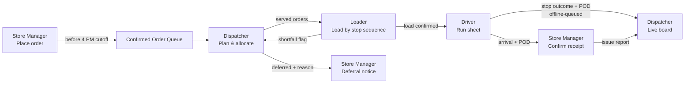

# WayLink — Delivery Planning System for Waypoint Group
### Tech-Triathlon 2026 · Designathon Submission · `TeamName_Designathon`

> **Deadline:** Tuesday, September 29, 2026, 11:59 PM (Asia/Colombo, UTC+05:30)
> **One-line pitch:** One shared delivery record that moves from store order → dispatcher plan → loader dock → driver stop → store receipt, and keeps working when the signal drops.

---

## 0. Design File Page Structure

Organize the design file (Figma or similar) into these distinct pages:

| # | Page | Contents |
|---|------|----------|
| 01 | Cover & Problem Framing | Project name, problem statement, prioritized problems |
| 02 | Personas | One persona per role (4) |
| 03 | System Flow | End-to-end workflow diagram across roles |
| 04 | Dispatcher Screens | Screens + one-paragraph rationale each |
| 05 | Loader Screens | Screens + rationale (phone/tablet sizes) |
| 06 | Driver Screens | Screens + rationale (phone size) |
| 07 | Store Manager Screens | Screens + rationale (desktop + phone) |
| 08 | Degradation Screens | Named failure scenarios + rationale |
| 09 | Core Tradeoff (optional) | One page / one diagram |
| 10 | Style Guide (optional) | Chameleon palette, type, components |
| 11 | AI Tool Disclosure | What was / wasn't AI-assisted |

---

## 1. Problem Framing

### 1.1 Problem statement
Waypoint's three brands (Fresh, Style, Tech) compete for one fleet of 60 vehicles across two depots (Peliyagoda, Kandy). Planning lives in one dispatcher's spreadsheet and memory, instructions travel by phone and paper, and nobody has a shared view once vehicles leave. Deferrals are decided under pressure with no record, so the same outlet can be skipped on consecutive runs.

**Our framing:** The core failure is not a missing optimizer — it is a *broken chain of information*. Every role acts on a different, outdated version of the plan. WayLink makes the **delivery record** the single source of truth that each role reads from and writes to.

### 1.2 Prioritized problems

| Priority | Problem (from brief) | Why this rank | Our response |
|:-:|---|---|---|
| P1 | Planning is fragmented | Root cause of most downstream errors | Unified order queue after 4 PM cutoff; constraint-validated plan builder |
| P1 | Deferrals lack a clear record | Repeat skips damage outlets and trust | Mandatory deferral reason + "skipped yesterday" flags surfaced in planning |
| P1 | Field connectivity is unreliable | Hill country / Kandy corridor lose signal | Offline-first driver app with sync queue |
| P2 | Delivery progress is hard to track | Dispatcher learns too late | Live stop status board fed by driver records |
| P2 | Communication lacks feedback | No proof of delivery / shortfall flag | Proof of delivery + loader shortfall flag before departure |
| P3 | Service time & lateness not predicted | Needs Datathon models | Reserved UI slots for predicted service time & late-risk badges |
| P3 | Demand hard to anticipate | Future-weeks planning | Simple capacity-forecast view (volume vs. fleet, chilled vs. reefer) |

### 1.3 Out of scope (restraint)
- Full turn-by-turn navigation (drivers use existing map apps; we deep-link).
- Driver scheduling / HR — the brief states each vehicle has a driver.
- Pricing, invoicing, inventory management.
- Customer-facing (shopper) features.

---

## 2. Personas

### 2.1 Dispatcher — *Nuwan Perera, 41*
- **Where:** Peliyagoda planning office, large monitor, stable connection.
- **Today:** Builds the daily plan in a spreadsheet from memory of outlet restrictions and vehicle quirks.
- **Goals:** Close orders at 4 PM, produce a feasible plan fast, defend deferral decisions.
- **Pains:** Blind after vehicles leave; can't prove *why* an outlet was skipped; festival weeks overwhelm capacity.
- **Needs from others:** Loader shortfalls before departure; driver stop outcomes in real time.
- **Quote:** *"I don't need the system to decide for me. I need it to stop me making a mistake I can't explain."*

### 2.2 Loader — *Kasun Jayasinghe, 29*
- **Where:** Peliyagoda / Kandy dock, shared tablet or terminal, gloves, noise, 2–3 AM starts for Fresh.
- **Today:** Printed loading lists that go stale when the plan changes.
- **Goals:** Load in reverse stop order so the driver unloads cleanly; flag missing or damaged items.
- **Pains:** Late plan changes by phone; no way to record a shortfall.
- **Needs from others:** Current stop sequence from the dispatcher.
- **Quote:** *"If the list changes, I need to see it here — not hear it shouted across the dock."*

### 2.3 Driver — *Ruwan Kumara, 36*
- **Where:** On the road, personal Android phone, often no signal past Kadugannawa.
- **Today:** Paper run sheet, phone calls for changes, disputes settled by memory.
- **Goals:** Finish Fresh drops before 8 AM; record each stop quickly while safely stopped.
- **Pains:** Signal drops; store claims "short delivery" days later.
- **Needs from others:** Updated run sheet; unloading notes (dock type, mall window).
- **Quote:** *"Give me big buttons and let it save without signal."*

### 2.4 Store Manager — *Dilini Fernando, 33* (Waypoint Fresh, Kandy)
- **Where:** Outlet counter, desktop or phone.
- **Today:** Orders by phone/message with no confirmation.
- **Goals:** Know the order was received; know when the truck arrives to roster staff.
- **Pains:** Silent deferrals; no easy way to report damaged goods.
- **Needs from others:** Order confirmation, ETA, deferral notice, proof of delivery.
- **Quote:** *"Just tell me if it's not coming. I can plan around bad news."*

---

## 3. End-to-End System Flow

**Cross-role connections (explicitly required by the brief):**
- Dispatcher's plan → Loader's stop-sequence list (instantly, with change highlights).
- Driver's delivery record → Store Manager's receipt screen (what arrived, when, photo/signature).

---

## 4. Screen Flows & Rationale

> Each screen gets a one-paragraph rationale in the design file. Draft rationales below.

### 4.1 Dispatcher (desktop, 1440px+)

| ID | Screen | Rationale |
|---|---|---|
| D-01 | **Order Queue (post-cutoff)** | Brings every confirmed order for tomorrow into one list, grouped by brand and depot, with chilled/ambient, van_only, mall window and "deferred yesterday" tags visible. This removes re-typing from phone messages and makes repeat-skip risk visible *before* planning starts. |
| D-02 | **Plan Builder** | Split view: orders on the left, vehicles/trips on the right. Assigning an order runs live checks (weight, volume, reefer, van_only, depot, time budget, fuel quota) and shows capacity bars. Invalid moves are blocked with a plain-language reason, so the dispatcher stays in control but can't create an infeasible plan. |
| D-03 | **Deferral Review** | Every order left unassigned must carry a reason (capacity, reefer shortage, access, time window). Outlets skipped on consecutive runs are pinned to the top. This creates the audit trail the brief says is missing and triggers store-manager notices. |
| D-04 | **Live Delivery Board** | Map + list of all active trips with stop status (pending, arrived, delivered, failed) and "last synced" time per vehicle. Shows problems as they happen instead of after the driver calls. |
| D-05 | **Capacity Outlook** | Forecast weekly volume vs. available fleet, with chilled volume vs. 16 reefer-capable vehicles highlighted ahead of paydays and festivals. Placeholder for Datathon outputs. |

### 4.2 Loader (tablet + phone, shared device)

| ID | Screen | Rationale |
|---|---|---|
| L-01 | **Vehicle Select / Bay Board** | Large tiles for each vehicle departing from this depot, sorted by departure time. Shared devices mean quick role PIN, not personal login. |
| L-02 | **Load List (reverse stop order)** | Items listed last-stop-first so the first drop sits by the door. Chilled items grouped and tagged. Any plan change since the list opened is highlighted in yellow and must be acknowledged. |
| L-03 | **Flag Shortfall / Damage** | Two taps: pick the item, pick "missing" or "damaged", optional photo. The flag reaches the dispatcher before departure, not after the store complains. |
| L-04 | **Load Confirmed** | Final checklist and "Release vehicle" action; records who loaded and when. |

### 4.3 Driver (phone, 360–414px, used when safely stopped)

| ID | Screen | Rationale |
|---|---|---|
| R-01 | **Today's Run** | Trip list with stop count, first window, and a clear online/offline indicator. The whole run downloads at depot sign-in so nothing depends on signal later. |
| R-02 | **Stop Detail** | Outlet name, window, dock type (rear dock / street / mall bay), mall access time, unloading notes, and items. One large "Arrived" button; deep link to maps. |
| R-03 | **Record Outcome + Proof of Delivery** | Delivered / Partial / Failed, with photo and store-staff signature or name. Partial and failed require a reason chip. Removes disputes that rely on memory. |
| R-04 | **Sync Queue** | Shows records saved on-device, pending upload, and synced. Builds trust that offline work is not lost. |

### 4.4 Store Manager (desktop + phone)

| ID | Screen | Rationale |
|---|---|---|
| S-01 | **Place Order** | Order form with brand-appropriate fields (dry vs. chilled for Fresh), countdown to the 4 PM cutoff, and a clear confirmation receipt. Replaces unconfirmed phone orders. |
| S-02 | **My Deliveries** | Status of each order: confirmed → scheduled → out for delivery → arrived, with expected arrival time so staff can be rostered. Deferred orders show the reason and the new run date. |
| S-03 | **Confirm Receipt** | Pre-filled from the driver's record; manager confirms or reports issues (short, damaged, late, temperature) item by item with photo. |

---

## 5. Degradation Screens

### 5.1 Primary: **"Dead Zone Drop"** — Driver offline on the Kandy corridor
**Scenario:** Ruwan loses signal on a hill-country route at stop 3 of 6. He must still record arrivals, outcomes and proof of delivery.

**Why it matters to Waypoint:** The brief names hill country, the Kandy corridor and rural districts as coverage gaps. If the app fails offline, drivers go back to paper, proof of delivery is lost, and the dispatcher's live board goes dark exactly where problems are most likely.

**Screen design:**
- Persistent **yellow banner**: "Offline — saving on this phone. 3 records waiting to sync."
- All stop actions remain available; each saved record shows a yellow "queued" chip.
- Timestamps captured on device (not server) so arrival times stay accurate.
- On reconnect: banner turns **emerald** "Synced 3 records · 07:12", and any conflicts (e.g., dispatcher reassigned a stop while offline) appear as a review card, never a silent overwrite.
- Dispatcher board shows that vehicle as "Last seen 06:41 · offline" rather than as delayed.

### 5.2 Secondary: **"Short at the Dock"** — Loader finds missing chilled stock
**Scenario:** Two chilled cases for a Fresh outlet are missing at 3:10 AM.
**Why it matters:** Discovering this at the outlet wastes a Fresh time slot and creates a dispute; flagging at the dock lets the dispatcher adjust and warn the store before 8 AM.
**Screen design:** Loader flags items → dispatcher gets an alert card with options (hold vehicle, send partial, re-plan) → store manager receives "Partial delivery expected" notice automatically.

### 5.3 Optional: **"Festival Crunch"** — Demand exceeds capacity
**Scenario:** Festival week; chilled demand exceeds the 16 reefer-capable vehicles.
**Screen design:** Plan Builder shows the limiting resource ("Reefer volume: 112% of available"), suggests deferral candidates ranked by days since last served, and requires a recorded reason for each deferral.

---

## 6. Core Tradeoff (optional page)

**Assisted planning vs. fully automatic allocation.**
We chose *assisted planning with validation*: the dispatcher makes decisions, the system blocks infeasible ones and explains why.
- **Gain:** Trust, explainability of deferrals, uses the dispatcher's local knowledge.
- **Cost:** Slower on very large days than a one-click optimizer.
- **Mitigation:** An "Auto-fill suggestion" the dispatcher can accept, edit, or reject.

---

## 7. Style Guide — Chameleon Palette

### 7.1 Concept
Like a chameleon, WayLink **adapts its colour emphasis to the environment** instead of using one fixed skin:
- **By context:** Driver and loader screens default to a **dark midnight-navy** surface (3–8 AM Fresh runs, cab glare, battery saving). Dispatcher and store manager use a **light** surface for long desk sessions.
- **By state:** The same components shift colour to communicate state — cobalt for *in progress*, emerald for *done/synced*, sunburst yellow for *attention/offline/deferred*.

Colour always pairs with an **icon + label**, never colour alone.

### 7.2 Core palette

| Token | Name | HEX | RGB | Primary use |
|---|---|---|---|---|
| `--cobalt-500` | Electric Cobalt Blue | `#0047FF` | 0, 71, 255 | Primary actions, links, in-progress status, selected states |
| `--emerald-500` | Vivid Emerald Green | `#00C46A` | 0, 196, 106 | Success fills, delivered, synced, capacity OK |
| `--sunburst-500` | Sunburst Yellow | `#FFC300` | 255, 195, 0 | Warnings, offline, deferred, plan-change highlights |
| `--navy-900` | Deep Midnight Navy | `#0B1437` | 11, 20, 55 | Dark surfaces, primary text on light, headers |

### 7.3 Extended tints & shades

| Family | 100 | 300 | 500 (base) | 700 | 900 |
|---|---|---|---|---|---|
| Cobalt | `#E6EDFF` | `#809FFF` | `#0047FF` | `#0034BD` | `#00227A` |
| Emerald | `#E0F9EE` | `#66DCA6` | `#00C46A` | `#047857` | `#064E3B` |
| Sunburst | `#FFF6D6` | `#FFDB66` | `#FFC300` | `#B38600` | `#6B5000` |
| Navy | `#E7E9F0` | `#8A91AB` | `#2A335A` | `#141D45` | `#0B1437` |

**Neutrals:** `#FFFFFF` · `#F5F7FB` (light background) · `#D9DDE8` (borders) · `#5B6480` (secondary text)
**Functional exception:** `--critical-500 #E5484D` — used *only* for failed delivery, temperature breach, and blocked constraint errors. Keeping red rare makes it meaningful.

### 7.4 Semantic tokens

| Semantic token | Light mode | Dark mode (driver/loader) |
|---|---|---|
| `--bg` | `#F5F7FB` | `#0B1437` |
| `--surface` | `#FFFFFF` | `#141D45` |
| `--text-primary` | `#0B1437` | `#FFFFFF` |
| `--text-secondary` | `#5B6480` | `#8A91AB` |
| `--action-primary` | `#0047FF` | `#809FFF` |
| `--status-success` | `#047857` (text) / `#00C46A` (fill) | `#00C46A` |
| `--status-warning` | `#6B5000` text on `#FFF6D6` | `#FFC300` |
| `--status-critical` | `#E5484D` | `#FF7B7F` |

### 7.5 Status colour mapping (shared across all four roles)

| Status | Colour | Icon | Label example |
|---|---|---|---|
| Confirmed / Scheduled | Navy 300 outline | ☐ clock | "Scheduled · Trip 1" |
| In progress / Out for delivery | Cobalt 500 | ➜ truck | "On the way · ETA 06:40" |
| Delivered / Synced | Emerald 500 | ✓ check | "Delivered 06:52" |
| Deferred / Offline / Changed | Sunburst 500 | ⚠ triangle | "Deferred to Thu · capacity" |
| Failed / Blocked | Critical 500 | ✕ | "Failed · outlet closed" |

### 7.6 Accessibility checks (WCAG 2.1 AA)

| Pair | Contrast | Result |
|---|---|---|
| Navy 900 on White | ~17.9 : 1 | ✅ Pass |
| Cobalt 500 on White | ~6.3 : 1 | ✅ Pass (text + buttons) |
| White on Cobalt 500 | ~6.3 : 1 | ✅ Pass |
| Sunburst 500 on Navy 900 | ~11 : 1 | ✅ Pass |
| Emerald 700 on White | ~5.5 : 1 | ✅ Pass (use for green text) |
| Emerald 500 on White | ~2.3 : 1 | ⚠ Fills/icons only, never body text |
| Sunburst 500 on White | ~1.6 : 1 | ❌ Never as text on white — use Sunburst 900 text on Sunburst 100 |

### 7.7 Typography
- **Typeface:** Inter (UI) with system fallback; **Noto Sans Sinhala / Tamil** for localized labels.
- **Numerals:** Tabular figures for times, weights, volumes.

| Style | Desktop | Mobile | Weight |
|---|---|---|---|
| Display | 32 / 40 | 26 / 32 | 700 |
| H1 | 24 / 32 | 22 / 28 | 700 |
| H2 | 20 / 28 | 18 / 24 | 600 |
| Body | 16 / 24 | 16 / 24 | 400 |
| Label | 14 / 20 | 14 / 20 | 500 |
| Caption | 12 / 16 | 13 / 18 | 400 |

Driver screens: minimum body 16px, key info (outlet, window) 20px+.

### 7.8 Spacing, layout & touch
- **Spacing scale:** 4 · 8 · 12 · 16 · 24 · 32 · 48
- **Radius:** 8px (inputs, chips) · 12px (cards) · 999px (status pills)
- **Grid:** Desktop 12-col / 24px gutter · Tablet 8-col · Phone 4-col / 16px margins
- **Touch targets:** min 48×48px; driver primary actions **56px tall, full width**, placed in the bottom thumb zone
- **Gloves-friendly (loader):** tile targets ≥ 64px

### 7.9 Core components
- **Buttons:** Primary (cobalt fill), Secondary (navy outline), Success confirm (emerald fill, navy text), Destructive (critical outline).
- **Status pill:** colour + icon + text (see 7.5).
- **Capacity bar:** weight / volume / time / fuel; cobalt fill, turns sunburst at 90%, critical at 100%.
- **Connectivity banner:** sunburst (offline, queued count) → emerald (synced, timestamp).
- **Constraint tag chips:** `Chilled` · `Van only` · `Mall 06:00–09:00` · `Rear dock` · `Skipped yesterday`.
- **Change highlight:** sunburst left border + "Changed 02:47 by Dispatcher" label.

### 7.10 Iconography
Outline icons, 2px stroke, 24px grid. Key set: truck, van, snowflake (chilled), clock (window), dock, camera (POD), cloud-off (offline), sync, warning, check.

---

## 8. Domain Accuracy Checklist

Make sure screens reflect these facts from the brief:

- [ ] 120 outlets: 80 Fresh, 25 Style, 15 Tech
- [ ] 2 depots: Peliyagoda DC, Kandy regional hub; vehicles serve only their home depot
- [ ] 60 vehicles: 12 reefer trucks, 40 dry-box trucks, 8 vans (4 reefer) → 16 chilled-capable
- [ ] Weight **and** volume limits per trip (Style fills volume before weight)
- [ ] Chilled goods only on reefer vehicles
- [ ] `van_only` outlets cannot be served by trucks
- [ ] Mall outlets restricted to fixed mall window
- [ ] Fresh arrives before 8 AM; Fresh can have two orders (dry + chilled) same day
- [ ] Orders close 4 PM for next day; late orders go to the following run
- [ ] Max 2 trips per vehicle per day; operating Monday–Saturday
- [ ] Weekly fuel quota per vehicle
- [ ] Every deferral has a recorded reason
- [ ] Dock types: rear dock, street, mall bay

---

## 9. Assumptions (mention in demo video)
1. Drivers have Android smartphones with a camera and enough storage for one day's run offline.
2. Loaders share a tablet per bay; identity via quick PIN.
3. Store managers can receive in-app plus SMS notifications.
4. Dispatcher remains the decision-maker; the system validates and suggests.
5. English UI first, with Sinhala/Tamil labels planned.

---

## 10. AI Tool Disclosure (template)

| Work item | AI-assisted? | Tool | How it was used |
|---|---|---|---|
| Problem framing & prioritization | ☐ Yes ☐ No | | |
| Personas | ☐ Yes ☐ No | | |
| Screen layouts / wireframes | ☐ Yes ☐ No | | |
| High-fidelity visuals | ☐ Yes ☐ No | | |
| Colour palette & style guide | ☐ Yes ☐ No | | |
| Rationale text | ☐ Yes ☐ No | | |
| Prototype interactions | ☐ Yes ☐ No | | |

*Statement:* Describe what the team decided and verified independently, and how AI output was reviewed and edited.

---

## 11. Submission Checklist

- [ ] Personas (4) — one per role
- [ ] Screen flows for all four roles, one-paragraph rationale per screen
- [ ] At least one fully designed degradation screen, named, with rationale
- [ ] High-fidelity clickable prototype (shareable link)
- [ ] 3–5 min unlisted YouTube demo video (walkthrough + assumptions)
- [ ] AI tool disclosure page
- [ ] Core tradeoff page (optional)
- [ ] Style guide page (optional)
- [ ] Export design file as `TeamName_Designathon` → compress to `TeamName_Designathon.zip`
- [ ] Submit via form: https://forms.gle/H6dqUZP6pXdGC8Go8 before **Tue 29 Sep 2026, 11:59 PM**

> Remember: the Hackathon build must follow this design. Keep screens realistic to build in 5 days, and record any later changes in the Hackathon README.
